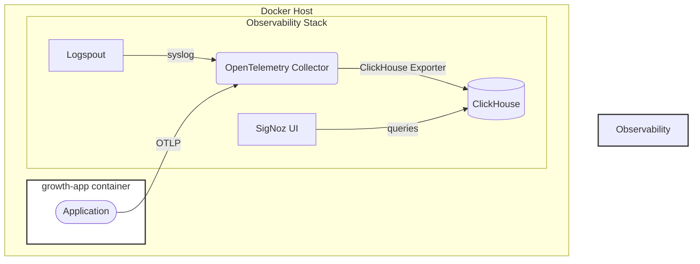

# Observability Architecture

This document outlines the observability architecture for the Growth project, which is based on the OpenTelemetry standard and the [SigNoz](https://signoz.io/) observability platform.

## Architecture Diagram

The following diagram illustrates the flow of telemetry data (logs, metrics, and traces) from the application to the observability platform.



## Components

### Application (`growth-app`)

The `growth-app` is the Elixir application that is being monitored. It is configured to send telemetry data to the OpenTelemetry Collector.

### Observability Stack

The observability stack is a collection of services that are responsible for collecting, processing, and storing telemetry data. It is defined in the `priv/docker/services/observability/docker-compose.yml` file and consists of the following services:

- **Logspout**: This service is responsible for collecting logs from all Docker containers running on the host that have the `com.docker.compose.project: growth` label. It forwards the logs to the OpenTelemetry Collector via syslog.

- **OpenTelemetry Collector (`otel-collector`)**: This is the central component of the observability stack. It receives telemetry data in various formats (OTLP, syslog, Prometheus), processes it, and exports it to ClickHouse. The collector is configured in `priv/docker/services/observability/config/otel-collector/config.yml`.

- **ClickHouse**: This is a fast, open-source, column-oriented database management system that is used to store all telemetry data.

- **SigNoz**: This is an open-source observability platform that provides a user interface for visualizing and analyzing the telemetry data stored in ClickHouse. It allows you to create dashboards, set up alerts, and explore traces, metrics, and logs.

## Data Flow

1.  **Logs**: The `logspout` service captures the logs from the `growth-app` container and sends them to the `otel-collector` on port `5140` using the `syslog` protocol. The collector then exports the logs to the `signoz_logs` table in ClickHouse.

2.  **Metrics**: The `otel-collector` scrapes Prometheus metrics from the `growth-app` container. The application exposes a `/metrics` endpoint that the collector scrapes every 30 seconds. The collector also receives metrics via OTLP. The metrics are then exported to the `signoz_metrics` table in ClickHouse.

3.  **Traces**: The application sends traces to the `otel-collector` using the OTLP protocol over gRPC (port `4317`) or HTTP (port `4318`). The collector processes the traces and exports them to the `signoz_traces` table in ClickHouse.

## How to Run

To run the observability stack, you can use the following command:

```bash
docker-compose --profile observability up
```

This will start all the services defined in the `priv/docker/services/observability/docker-compose.yml` file. You can then access the SigNoz UI by navigating to `http://localhost:8080` in your web browser.
